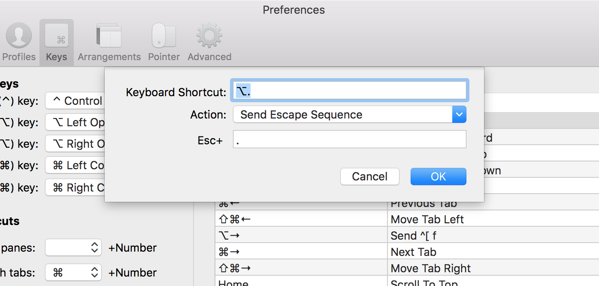

# the ZSH .dotfiles

These are my extremely useful dotfiles for the **zsh** shell.
(Dotfiles are hidden files, whose filenames start with a `.` dot. The dotfiles are sourced whenever you start a command line session. And these dotfiles are really useful, containing a lot of smart things, shortscuts and nice colors.)

These instructions can be applied to both the **Terminal** app or the **iTerm** app.

## Step 1: install **zsh** as your default shell

### On macOS's **Terminal** app

- Start the **Terminal** app
- open the **Preferences** window,
- the **General** tab.
- There where it says "**Shells open with:**",
- select "**Command (complete path)**"
- and type: `/bin/zsh`

### On **iTerm2** app

- Start the **iTerm** app
- open the **Preferences** window,
- go to the **Profiles** tab,
- select the Profile that you want to modify (or create a new Profile, and *Set as Default*)
- the **General** tab.
- Under the "**Command**" haeder,
- select "**Command:**"
- and type: `/bin/zsh --login`

From then on, every new Terminal or iTerm window or tab you'll open, will be starting the zsh shell. Hurray!

## Step 2: install the *dot files* in your root folder

Then you'll need to install these dotfiles in your root folder in order to use them:

- Go to your root directory if you weren't there yet:
	- `cd ~`
- Download the dotfiles by:
	- `curl -sL https://github.com/irlabs/zsh-dotfiles/raw/master/zsh_dotfiles.tar > zsh_dotfiles.tar`
- Unpack and install the dotfiles:
	- `tar -xzf zsh_dotfiles.tar`
	
Then, from then on, every time you start a zsh shell, these dotfiles will be loaded and you can enjoy the nice colored prompt, handy shortcuts like `l` and `ll` and colored outputs for file lists, and, and ...

## Step 3: Set up the **Alt + .** key

### In macOS's **Terminal**: Use the Alt key as Meta key

- In the **Terminal** app
- open the **Preferences** window,
- go to the **Profiles** tab.
- Select the **Keyboard** section.
- Make sure that all the profiles that you are using have:
- the checkbox **Use Option as Meta key** enabled.

### In the **iTerm2** app

- In the **iTerm** app
- open the **Preferences** window,
- go to the **Keys** tab,
- click the **+** button to create a new *Key Mapping*
	- As *Keyboard Shortcut* set **Alt + .**
	- As *Action* choose **Send Escape Sequence** 
	- As *Esc+* set **.**

